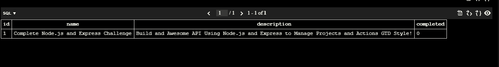
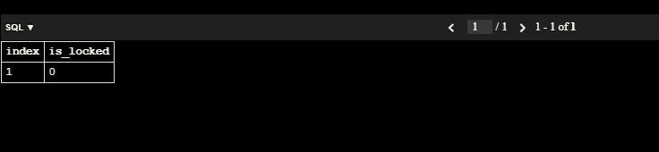
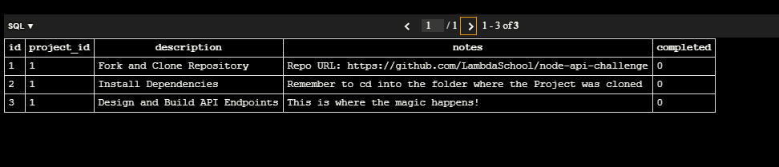
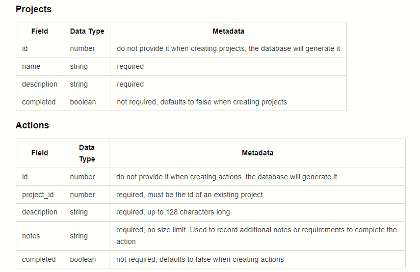

# Sprint Notes

id,project_id,description,notes,completed
1,1,Fork and Clone Repository,Repo URL: https://github.com/LambdaSchool/node-api-challenge,0
2,1,Install Dependencies,Remember to cd into the folder where the Project was cloned,0
3,1,Design and Build API Endpoints,This is where the magic happens!,0

# Table projects:

# Knex Migrations:

# Knex Migrations Lock:

# Table Actions:

